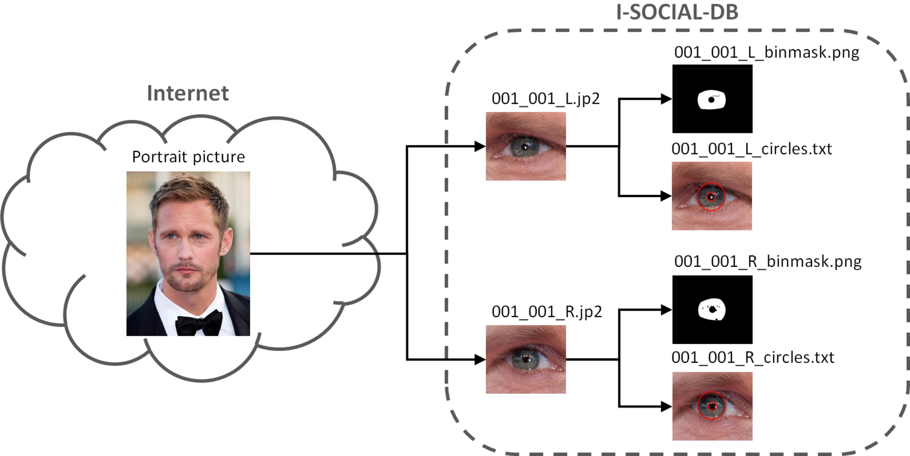

<div align="center">

# 👁️ I-SOCIAL-DB

### A Labeled Database of Images Collected from Websites and Social Media for Iris Recognition

[](https://www.mathworks.com/products/matlab.html)
[](https://www.python.org/)
[](https://www.sciencedirect.com/science/article/pii/S0262885620301906)
[](http://iebil.di.unimi.it/ISocialDB/index.html)
[](http://iebil.di.unimi.it/ISocialDB/index.html)

**Demonstration scripts and utilities for the 2021 Image and Vision Computing paper**  
*I-SOCIAL-DB: A labeled database of images collected from websites and social media for iris recognition*

</div>

---

## 🌐 Overview

**I-SOCIAL-DB** is a dataset and evaluation resource designed to support research on **iris recognition from unconstrained images collected from websites and social media**.

Unlike traditional iris datasets acquired with controlled sensors, I-SOCIAL-DB focuses on ocular regions extracted from high-resolution face images available in less controlled, real-world-like scenarios.

The database includes manually labeled information useful for iris segmentation and recognition research, including:

- 👁️ ocular-region images
- 🎯 iris boundary annotations
- 🧩 pixelwise segmentation masks
- ✨ occlusion and reflection labels
- 📊 testing protocols and benchmark material

---

## 🧠 Research Motivation

Images uploaded to websites and social platforms are often high resolution and may contain enough detail to analyze biometric traits beyond the face. I-SOCIAL-DB was created to help study whether **iris recognition** can be performed on this kind of imagery, where acquisition conditions are more challenging than in classical biometric datasets.

<div align="center">

```text
High-resolution face images
          │
          ▼
Ocular region extraction
          │
          ▼
Manual iris annotation
          │
          ├── Inner iris boundary
          ├── Outer iris boundary
          ├── Iris mask
          ├── Occlusions
          └── Reflections
          │
          ▼
Segmentation and recognition evaluation
```

</div>

---

## 📁 Repository Structure



```text
I-SOCIAL-DB/
│
├── README.md
│
└── code/
    ├── plot_I_SOCIAL.m          # Plot iris image, segmentation mask, and iris boundaries
    ├── convert_JP2_to_BMP.m     # MATLAB JPEG2000-to-BMP conversion utility
    └── convert_JP2_to_BMP.py    # Python JPEG2000-to-BMP conversion utility
```

---

## 🚀 Getting Started

### 1. Clone the repository

```bash
git clone https://github.com/AngeloUNIMI/I-SOCIAL-DB.git
cd I-SOCIAL-DB
```

### 2. Download the dataset

The dataset is distributed through the official project page:

```text
http://iebil.di.unimi.it/ISocialDB/index.html
```

Place the downloaded data according to the paths expected by the scripts, or update the paths inside the scripts before running them.

---

## 🖼️ Plot Iris Annotations

The MATLAB script:

```text
code/plot_I_SOCIAL.m
```

can be used to visualize:

- the ocular image
- the manually segmented iris mask
- the circles approximating the inner and outer iris boundaries

Run it from MATLAB after setting the correct dataset paths:

```matlab
cd code
plot_I_SOCIAL
```

---

## 🔁 Convert JPEG2000 Images to BMP

The repository includes both MATLAB and Python conversion utilities.

### MATLAB

```matlab
cd code
convert_JP2_to_BMP
```

### Python

```bash
cd code
python convert_JP2_to_BMP.py
```

These scripts are useful when working with environments or algorithms that expect images in BMP format.

---

## 📊 Dataset Highlights

According to the project description, I-SOCIAL-DB contains:

| Item | Description |
|---|---|
| Ocular regions | Extracted from high-resolution face images |
| Individuals | 400 subjects |
| Face images | 1,643 high-resolution images |
| Ocular samples | 3,286 ocular regions |
| Labels | Human-expert manual annotations |
| Annotations | Iris boundaries, masks, occlusions, and reflections |

---

## 🧪 Suggested Use Cases

I-SOCIAL-DB can be used for research on:

- iris segmentation in unconstrained imagery
- iris recognition from social-media-style images
- biometric recognition under non-ideal acquisition conditions
- ocular-region analysis
- robustness testing of segmentation and recognition algorithms
- comparison of controlled vs. uncontrolled iris recognition scenarios

---

## 📌 Main Files

| File | Purpose |
|---|---|
| `plot_I_SOCIAL.m` | Displays iris images, segmentation masks, and circular iris boundary annotations |
| `convert_JP2_to_BMP.m` | Converts JPEG2000 images to BMP using MATLAB |
| `convert_JP2_to_BMP.py` | Converts JPEG2000 images to BMP using Python |

---

## 📚 Paper

If you use this dataset or the related scripts, please cite:

```bibtex
@Article{imavis20,
  author  = {R. {Donida Labati} and A. Genovese and V. Piuri and F. Scotti and S. Vishwakarma},
  title   = {I-SOCIAL-DB: A labeled database of images collected from websites and social media for iris recognition},
  journal = {Image and Vision Computing},
  volume  = {105},
  number  = {104058},
  pages   = {1--9},
  month   = {January},
  year    = {2021},
  note    = {0262-8856}
}
```

Paper:

```text
https://www.sciencedirect.com/science/article/pii/S0262885620301906
```

Project page:

```text
http://iebil.di.unimi.it/ISocialDB/index.html
```

---

## 👥 Authors

- **R. Donida Labati**
- **Angelo Genovese**
- **Vincenzo Piuri**
- **Fabio Scotti**
- **S. Vishwakarma**

Department of Computer Science  
Università degli Studi di Milano, Italy

---

## 🏛️ Acknowledgment

This repository provides demonstration scripts associated with the I-SOCIAL-DB research work. Please refer to the official project page and paper for dataset access conditions, benchmark details, and citation requirements.
